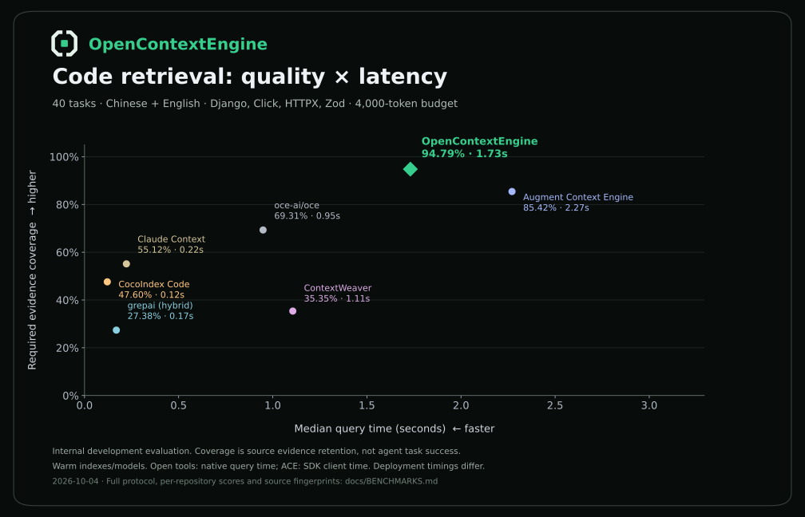

<div align="center">
  <picture>
    <source media="(prefers-color-scheme: dark)" srcset="assets/brand/logo-lockup-dark.svg">
    
  </picture>
  <p><strong>Precise code context for AI coding agents.</strong></p>
  <p>Find related code across files. Follow its connections. Give your agent the evidence it needs.</p>
  <p>
    <a href="docs/BENCHMARKS.md#seven-method-comparison"></a>
    <a href="docs/BENCHMARKS.md#seven-method-comparison"></a>
    <a href="docs/BENCHMARKS.md#engineering-validation"></a>
    <a href="docs/QUICKSTART.md"></a>
  </p>
  <p><a href="#quick-start">Quick start</a> · <a href="docs/BENCHMARKS.md">Benchmarks</a> · <a href="docs/QUICKSTART.md">MCP setup</a></p>
</div>

OpenContextEngine is a **self-hostable code context engine** that turns natural-language tasks into relevant source code, with original file paths and line numbers. It combines semantic and keyword search, structural relationships, and neural reranking within a fixed context budget.

## Why OpenContextEngine

- **Search beyond exact words.** Describe a behavior; retrieve its implementation and connected code across files.
- **Understand code structure.** Python, TypeScript, JavaScript, and Go adapters, plus text fallback for other languages, configuration, and scripts.
- **Stay current as you edit.** Saved changes, file deletions, and branch switches sync automatically. Unchanged embeddings are reused; incomplete updates never replace a complete index.
- **Work across projects through MCP.** Your agent supplies the project path; indexes start on demand and are reused. `search_code` retrieves evidence; `index_status` reports synchronization.

## Measured results



**94.79% required evidence coverage · 1.73 s median retrieval · 69/80 queries with complete evidence.** Seven engines, four repositories, the same 4,000-token output budget. OpenContextEngine retained the most required evidence in this internal development evaluation.

Measured with the optional batch rerank API. 40 source-derived tasks, each asked in Chinese and English. Coverage measures source evidence, not coding-agent success. Timings reflect native retrieval for open tools and SDK client calls for ACE. [Full comparison, configurations, and per-query results →](docs/eval/METHOD_COMPARISON.md)

## Quick start

Requires **macOS or Linux**, Node.js 22.14+, Python 3.10+, Git, and configured embedding/reranking services. Go repositories also need Go 1.22+.

```sh
git clone https://github.com/AnnaSuSu/OpenContextEngine.git
cd OpenContextEngine
npm ci
python3 -m venv .venv
.venv/bin/pip install -r requirements.txt
cp .env.example .env
```

Set your model endpoints and keys in `.env`, then add this server to an MCP client:

```json
{
  "mcpServers": {
    "opencontextengine": {
      "command": "node",
      "args": [
        "/absolute/path/to/OpenContextEngine/scripts/mcp-opencontextengine.mjs"
      ]
    }
  }
}
```

Your agent passes the current project's absolute path as `directory_path`. The MCP server starts its index on first use and reuses it across searches. To pin one project, add `--root /absolute/path/to/your-repository`. **Save your code; the index follows.** [Model configuration, shared services, and update behavior →](docs/QUICKSTART.md)

## Explore

[Benchmark report](docs/BENCHMARKS.md) · [Raw evaluations](docs/eval/results) · [Retrieval engine](src/retrieval) · [Logo assets](assets/brand)

## Repository layout

| Directory | Contents |
| --- | --- |
| `src/` | Retrieval engine, model API clients, MCP and service code |
| `tests/` | Automated regression and integration tests |
| `docs/` | Setup, architecture, and published evaluation reports |
| `eval/` | Frozen benchmark protocols, queries, reference evidence, and snapshots |
| `scripts/` | Product entry points and public evaluation tools ([guide](scripts/README.md)) |
| `assets/` | Project branding and published benchmark charts |

Machine-specific notes, provider experiments, and retired development material belong in the ignored `.local/` directory. Keep secrets in the ignored `.env`; publish only generic configuration in `.env.example`.
