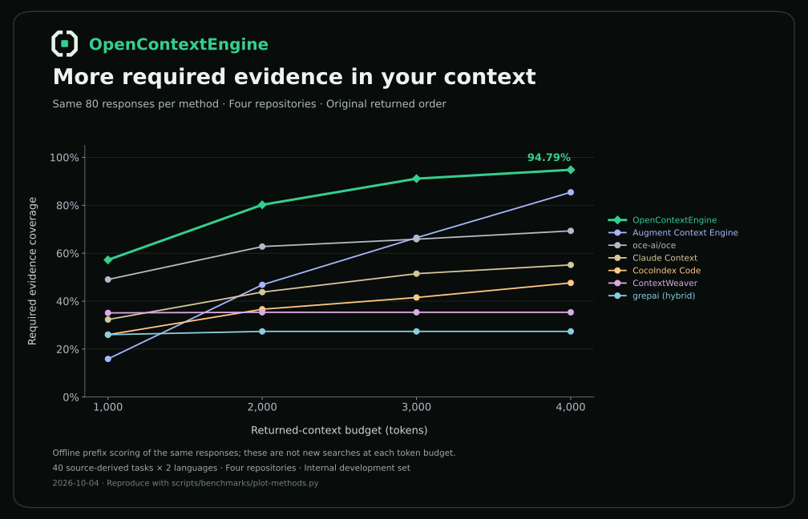

# Benchmarks & validation

OpenContextEngine. Results recorded on **October 3–4, 2026**. Coverage measures whether returned source includes the required evidence for a task; it is not code-generation accuracy or agent task success.

## Seven-method comparison

**560 successful queries: seven engines × 40 tasks × two languages**, on frozen Django, Click, HTTPX and Zod source subsets. All methods use the same 4,000-token output budget.



| Method | Required evidence coverage | Complete-evidence queries | Median query time |
| --- | ---: | ---: | ---: |
| OpenContextEngine | 94.79% | 69/80 | 1.731 s |
| Augment Context Engine SDK | 85.42% | 49/80 | 2.271 s |
| oce-ai/oce | 69.31% | 26/80 | 0.949 s |
| Claude Context (hybrid) | 55.12% | 17/80 | 0.223 s |
| CocoIndex Code | 47.60% | 13/80 | 0.121 s |
| ContextWeaver | 35.35% | 9/80 | 1.107 s |
| grepai (hybrid) | 27.38% | 3/80 | 0.169 s |

OpenContextEngine leads on all four repositories and all four scored context budgets in this internal development set. At 4,000 tokens, coverage is **9.38 percentage points above ACE**, with **20 more complete-evidence queries**.

The comparison uses exact source-line verification, ignoring required blank lines. It measures evidence retention, including returned source fidelity. Native snippet formatting and line-coordinate errors can affect scores. Open tools use native query timings on the remote evaluation host; ACE uses SDK client timings. The curve uses offline prefixes of the same responses at 1,000/2,000/3,000/4,000 tokens. These are development tasks, not an independent held-out benchmark.

[Full English report and quality–latency chart](eval/METHOD_COMPARISON.md) · [Per-query scores](eval/results/method-comparison-20261004.json) · [Completeness audit](eval/results/method-audit-20261004.json)

The following sections preserve earlier experiments with different datasets or configurations.

## Retrieval speed

The `shared-intent-v4` update was evaluated on **76 development queries** across four repositories. Queries, source indexes, and reference evidence were held fixed. Qwen3-Embedding-4B and Qwen3-Reranker-4B ran on remote model services; each response had a **4,000-token budget** with no cross-query result cache.

| Repository | Queries | Previous median | Updated median | Updated evidence coverage |
| --- | ---: | ---: | ---: | ---: |
| Click | 20 | 4.952 s | 2.001 s | 100% |
| HTTPX | 20 | 4.391 s | 1.801 s | 85% |
| Zod | 20 | 3.766 s | 1.551 s | 98.33% |
| esbuild | 16 | 6.368 s | 2.546 s | 81.25% |

Across queries, median retrieval fell from **4.713 s to 1.897 s**. Mean per-query evidence coverage increased from **91.34% to 91.67%**: **75 queries unchanged, one improved, none regressed**. This aggregate weights queries equally; repository query counts differ.

Timings are measured inside the remote retrieval process, excluding indexing, model startup, and client transport. The final run followed fixes identified during development. This is a development regression, not a held-out benchmark or a new ACE comparison.

[Raw results and source fingerprints](eval/results/shared-intent-20261004.json) · [Detailed speed report](eval/SHARED_INTENT.md)

## Frozen comparison with Augment Context Engine

**30 tasks**, each asked in Chinese and English, across Click, HTTPX, and Zod. Both systems searched the same frozen source subsets. Outputs were scored within **4,000 tokens**, including file paths and line numbers.

| Metric | OpenContextEngine | ACE SDK |
| --- | ---: | ---: |
| Required evidence coverage | **90.14%** | 85.69% |
| Complete-evidence queries | **48 / 60 (80%)** | 40 / 60 (66.67%) |
| Successful requests | 60 / 60 | 60 / 60 |
| Median client latency | 3.76 s | **2.15 s** |
| P95 client latency | 5.94 s | **3.16 s** |

OpenContextEngine led on Click and HTTPX; ACE led on Zod and was faster overall. ACE's unrestricted responses were longer and had higher coverage; the table describes **equal-budget evidence retention**. It does not establish higher unrestricted recall.

ACE used `@augmentcode/auggie-sdk@0.2.0` and `DirectContext.search()`. Tasks and reference evidence were written by Codex from source before querying. Configuration was frozen for this run. The bilingual queries are paired versions of 30 tasks, not 60 independent tasks. The published scoring is retained; a later blank-line scoring diagnostic is linked in the detailed report.

[Methodology, per-repository results, and scoring notes](eval/EXPANDED_EVAL.md) · [Frozen task set](../eval/expanded-v1)

## JavaScript & Go

Final development results with fast retrieval and default syntax-based structure analysis:

| Repository | Queries | Evidence coverage | Complete-evidence queries | Median retrieval |
| --- | ---: | ---: | ---: | ---: |
| Cobra | 8 | 87.5% | 5 / 8 | 2.027 s |
| Commander | 8 | 100% | 8 / 8 | 2.767 s |
| esbuild | 16 | 84.38% | 13 / 16 | 2.426 s |

This is a separate run from the speed table, with different structural indexes. Optional Go type analysis improved Cobra but reduced esbuild coverage, so syntax analysis remains the default. These small, source-derived sets establish working language support and observed behavior, not broad superiority.

[Structure ablations and type-analysis report](eval/JS_GO.md) · [Raw final comparison](eval/results/go-types-20261004.json)

## Engineering validation

**83 tests verified: 55 Python + 28 Node.js**, including source fidelity, language relationships, embedding reuse, branch changes, update failures, HTTP authentication, and official MCP client integration. This is a recorded local test result, not a live CI status badge.

A separate **real remote-model MCP smoke test** verified initial indexing, saved-file updates, deletion, and restart recovery. Editing one function embedded **one new document and reused two unchanged units**. Requests that encounter failed synchronization or source changes during retrieval return explicit errors instead of stale evidence.

[Remote MCP smoke record](eval/results/mcp-live-smoke-20261004.json) · [Tests](../tests) · [Smoke runner](../scripts/smoke-mcp.mjs)

```sh
npm test
.venv/bin/python -m unittest discover -s tests -p '*_test.py'
# Requires configured remote models; saves a separate report for each run.
node scripts/smoke-mcp.mjs
```

Python tests involving Go require the Go toolchain (`OCE_GO_BINARY` may specify its path). Large-repository indexing cost and independent retrieval quality remain to be measured.
