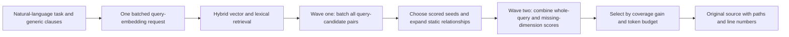

# OpenContextEngine speed refactor: preserve coverage and shorten online execution

2026-10-03. The default engine changed to `batched-dag-v4`, deployed on an authorized GPU server with a persistent HTTP service and Mac CLI. At a fixed 4,000-token budget, Chinese / English reference-evidence coverage remains **86.33% / 84.67%**. Across three Mac-client rounds over SSH, totaling 60 requests, median latency is **3.2705 seconds**, P95 **4.790 seconds**, and maximum **4.904 seconds**. The original median was 15.2315 seconds, an observed speedup of about **4.66 times**.

These repeat the same ten Django development tasks and 20 bilingual queries for three rounds; 60 requests are not 60 independent tasks. Models and indexes remain resident, but every query reruns embedding and neural reranking without a query-result cache. Quality measures source-verified reference-evidence coverage, not human relevance or task success. Client median latency remains above 3 seconds, and other repositories were not yet validated in this experiment.

## Same-task experiments and final choice

All variants use reference answers v2 for offline scoring only. Models remain Qwen3-Embedding-4B and Qwen3-Reranker-4B, with all inference on remote servers.

| Variant | Chinese coverage | English coverage | Queries | Median latency | P95 | Decision |
| --- | ---: | ---: | ---: | ---: | ---: | --- |
| ACE / DirectContext, existing reference | 86.50% | 84.00% | 20 | 2.824 s | 3.629 s | Retained reference |
| Original serial OpenContextEngine | 86.33% | 84.67% | 20 | 15.232 s | 68.279 s | Historical baseline |
| Single-stage whole-query reranking | 86.33% | 79.17% | 20 | 1.408 s | 1.998 s | Rejected: lower English coverage |
| Complete-function entity retrieval | 80.83% | 79.17% | 20 | 1.592 s | 1.891 s | Rejected: lower coverage in both languages |
| Two batch-scoring waves, server-side test | 86.33% | 84.67% | 20 | 3.093 s | 4.380 s | Passed quality checks |
| **Two batch-scoring waves, Mac client, batch 32 / 8192 tokens** | **86.33%** | **84.67%** | **60** | **3.271 s** | **4.790 s** | **Final default** |
| Same algorithm, Mac client, batch 64 / 16384 tokens | 86.33% | 84.67% | 60 | 3.843 s | 5.219 s | Slower; restored batch 32 |

Latency uses each complete query record. P95 is nearest-rank; medians for even sample counts average the middle two values. Original and final variants differ in transport, persistence, and batching. The 4.66-times improvement is end-to-end engineering work, not the effect of one algorithm component. ACE also differs in internal hardware, models, and pipeline; these results do not establish broad superiority over ACE.

The three final client rounds are:

| Round | Median | P95 | Maximum | Complete task retrieval, Chinese / English |
| --- | ---: | ---: | ---: | --- |
| 1 | 3.207 s | 4.835 s | 4.841 s | 5/10, 5/10 |
| 2 | 3.271 s | 4.503 s | 4.904 s | 5/10, 5/10 |
| 3 | 3.274 s | 4.485 s | 4.790 s | 5/10, 5/10 |

Macro-average coverage is identical across rounds. All 60 requests completed, returned source passed line-by-line verification without invalid references, and outputs stayed within 4,000 tokens. Latency excludes initial indexing and service startup: the original index took 346.2 seconds to build, and persistent-engine initialization about 2.2 seconds. The client rotates query order between rounds without reusing query vectors, reranking scores, or results.

## Why retain two scoring waves

The single-stage variant builds candidates through vector, lexical, and structural retrieval, then performs only one whole-query neural scoring pass. It is faster, but its English candidate coverage is already lower, so final reranking cannot recover evidence outside the candidate set. Complete-function entities do not improve this tradeoff. Questions, special symbol rules, and reference-answer hints were not used to recover scores.

The final approach preserves original candidate generation, seed expansion, and budget selection, organizing reranking by data dependencies:



First-wave subquestion scores are independent and can be combined into one `/v1/rerank-batch` request. Relationship expansion depends on first-wave seeds, preserving that order. Whole-query scores and missing per-dimension scores after expansion are combined again. Identical query/unit pairs are deduplicated only within a search and discarded afterward.

The GPU groups pairs by token length, with at most 32 pairs and 8,192 padded tokens by default, using the same 4B model's BF16 yes/no logits. Larger batch/token capacities were slower on these short-code candidates and were not enabled. Shared-prefix KV reuse within a request also produced no stable benefit and was reverted.

Structural and lexical indexes stay resident. The Mac accesses retrieval over SSH; retrieval calls reranking locally on the same GPU server and embedding through inter-server SSH. Avoiding repeated initialization and public forwarding delays contributes to the improvement. The implementation uses Python AST, static symbols and relationships, hybrid retrieval, and budget selection; ColBERT and generative gap analysis are not implemented.

## Usage for this historical deployment

The project `.env` contains remote-model configuration. The client defaults to `OCE_BASE_URL=http://127.0.0.1:45005`. Without a separate `OCE_API_KEY`, it uses the existing `RERANK_API_KEY`; keys appear neither in command arguments nor in this document.

```sh
npm run --silent search -- 'Find the code handling Django built-in web login: after a user submits a username and password, how is identity verified and a login session established?'
```

stdout returns source context. stderr reports client latency, retrieval latency, token count, and cache state. At this stage, the service loads a frozen Django index without one-command onboarding for arbitrary repositories. It listens only on remote `127.0.0.1:23505`. If the local 45005 SSH tunnel is disconnected, establish it in a separate terminal, setting your own `SSH_PORT` and replacing the example host:

```sh
ssh -N -L 127.0.0.1:45005:127.0.0.1:23505 -p "$SSH_PORT" operator@evaluation-host.example
```

The HTTP interface is `POST /search` with Bearer authentication and JSON fields `query`, `budget` (default 4000), and `trace` (default false). `GET /healthz` returns engine version, source hashes, index metadata, and reranking configuration. This reflects startup configuration; actual calls remain subject to remote-model and network availability. Requests execute one at a time, with queue and client timeouts. Concurrent throughput was not validated.

Measurements use the persistent retrieval process and remote reranking service. See the [reranker API](../RERANKER_API.md) for the interface and generic service implementation.

## Validation and reproducible evidence

- Node client, remote-model configuration, and evaluation tools: 23 tests passed.
- Python retrieval: 4 tests passed, including identical final outputs between batch execution and the reference implementation under fixed pair scores. Real models may still have small score changes due to BF16 batch shape.
- API checks cover authentication failures and invalid inputs. Final deployment verifies local/remote source SHA256, batch 32 / 8192-token configuration, and a real CLI query.
- [Machine-readable results](results/reponerve-speed-20261003.json) retain round paths, configuration, latency, quality, report/scoring hashes, and final deployment state. The [final health snapshot](results/reponerve-speed-final-health-20261003.json) separately stores deployment fingerprints.

```sh
# Rebuild summaries from local frozen source and original run records, without model calls.
python3 scripts/summarize-speed.py
# Repeat three rounds against the current service, making 60 actual queries.
npm run benchmark-service
# Score a round's saved original outputs offline.
npm run score-django -- RUN_DIRECTORY answers.v2.json
```

Original records remain in local `runs/`, excluded from Git. Summary paths and hashes locate and verify them. All experiments use existing development tasks to choose architecture and configuration, without an independent held-out set. Cross-repository behavior, initial cold starts, long tasks, and multi-client throughput require separate measurement.
