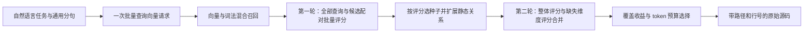

# RepoNerve 速度重构：保留覆盖率，缩短在线执行路径

2026-10-03。默认引擎改为 `batched-dag-v4`，已部署到授权 GPU 服务器，提供常驻 HTTP 服务与 Mac CLI。固定 4,000 token 预算下，中文 / 英文参考证据覆盖率保持 **86.33% / 84.67%**；Mac 经 SSH 调用的三轮 60 次请求中，中位 **3.2705 秒**、P95 **4.790 秒**、最大 **4.904 秒**。原版中位 15.2315 秒，实测缩短约 **4.66 倍**。

这是同一组 Django 十道开发题、20 个中英文查询重复三轮；60 次请求不是 60 道独立题。模型与索引常驻，每次查询重新执行 embedding 与神经重排，没有查询结果缓存。质量指标是源码核验的参考证据覆盖率，不是人工相关性判断或任务成功率。尚未达到客户端中位低于 3 秒，也未验证其他仓库。

## 同题实验与最终选择

统一使用参考答案 v2，答案只用于离线评分。模型保持 Qwen3-Embedding-4B 与 Qwen3-Reranker-4B，模型推理全部在远程服务器。

| 方案 | 中文覆盖率 | 英文覆盖率 | 查询数 | 中位延迟 | P95 | 选择 |
| --- | ---: | ---: | ---: | ---: | ---: | --- |
| ACE / DirectContext，原有参照 | 86.50% | 84.00% | 20 | 2.824 s | 3.629 s | 保留参照 |
| RepoNerve 原版串行执行 | 86.33% | 84.67% | 20 | 15.232 s | 68.279 s | 历史基线 |
| 单阶段整体重排 | 86.33% | 79.17% | 20 | 1.408 s | 1.998 s | 英文覆盖下降，未采用 |
| 完整函数实体检索 | 80.83% | 79.17% | 20 | 1.592 s | 1.891 s | 双语覆盖下降，未采用 |
| 两轮批量评分，服务器内测 | 86.33% | 84.67% | 20 | 3.093 s | 4.380 s | 通过质量检查 |
| **两轮批量评分，Mac 客户端，batch 32 / 8192 tokens** | **86.33%** | **84.67%** | **60** | **3.271 s** | **4.790 s** | **最终默认** |
| 同一算法，Mac 客户端，batch 64 / 16384 tokens | 86.33% | 84.67% | 60 | 3.843 s | 5.219 s | 更慢，已恢复 batch 32 |

延迟取每次完整查询记录；P95 用 nearest-rank，偶数样本的中位数取中央两值平均。原版与最终版的部署链路、常驻方式及批量执行不同，4.66 倍是端到端工程改进，不能全部归因于单一算法组件。ACE 的服务内部硬件、模型与流水线不同，这组结果也不支持“全面超过 ACE”。

三轮最终客户端结果分别为：

| 轮次 | 中位 | P95 | 最大 | 中文 / 英文完整任务召回 |
| --- | ---: | ---: | ---: | --- |
| 1 | 3.207 s | 4.835 s | 4.841 s | 5/10、5/10 |
| 2 | 3.271 s | 4.503 s | 4.904 s | 5/10、5/10 |
| 3 | 3.274 s | 4.485 s | 4.790 s | 5/10、5/10 |

三轮的宏平均覆盖率相同；全部 60 次完成，返回源码逐行校验无无效引用，输出均在 4,000 token 内。以上延迟不含首次索引及服务启动：原索引构建 346.2 秒，常驻引擎初始化约 2.2 秒。客户端循环旋转查询顺序，未在重复轮次间复用查询向量、重排分数或结果。

## 为什么保留两轮评分

单阶段方案先通过向量、词法与结构关系拼成候选，再只做一次整体神经评分。它确实更快，但英文候选上限已下降，最终重排无法找回候选之外的证据。完整函数实体方案也没有改善这一取舍，因此没有通过改题、特殊符号规则或参考答案提示来补分。

最终方案保留原版候选、种子扩展与预算选择逻辑，重排计算按数据依赖组织：



第一轮各子问题的评分相互独立，可合并为一次 `/v1/rerank-batch`。关系扩展依赖第一轮种子，因此保留这一顺序；扩展后的整体评分与各维度缺失评分再次合并。相同「查询、片段」配对只在单次搜索内去重，搜索结束即丢弃。

GPU 对所有待评分配对按 token 长度分组，默认最多 32 对、padding 后最多 8,192 token；仍用同一 4B 模型的 BF16 yes/no logits。更大的 batch/token 容量在这批短代码候选上变慢，实测后未启用。单请求公共前缀 KV 复用也未带来稳定收益，已回退。

结构及词法索引常驻进程，Mac 经 SSH 访问检索服务；检索服务在同一 GPU 服务器本地调用重排，另通过服务器间 SSH 连接 embedding。减少重复初始化和公网转发等待也是本次改善的一部分。当前使用 Python AST、静态符号与关系、混合召回及预算选择；没有实现 ColBERT 或生成式缺口分析。

## 现在如何使用

项目 `.env` 已有远程模型配置。客户端默认 `REPONERVE_BASE_URL=http://127.0.0.1:45005`；未单独设置 `REPONERVE_API_KEY` 时使用已有 `RERANK_API_KEY`，密钥不出现在命令参数或本文中。

```sh
npm run --silent search -- '找到 Django 内置网页登录的处理代码：用户提交账号密码后，怎么验证身份并建立登录会话？'
```

stdout 返回源码上下文，stderr 返回客户端延迟、检索延迟、token 数和缓存状态。当前服务加载冻结的 Django 索引，尚未提供任意仓库一键接入。服务只监听远程 `127.0.0.1:23505`；若本机 45005 的 SSH 隧道已断开，可在单独终端建立：

```sh
ssh -N -L 127.0.0.1:45005:127.0.0.1:23505 -p 40006 operator@evaluation-host.example
```

HTTP 接口为 `POST /search`，需要 Bearer 鉴权，JSON 参数是 `query`、`budget`（默认 4000）与 `trace`（默认 false）。`GET /healthz` 返回引擎版本、源码哈希、索引元数据与重排配置；该接口表示启动时加载的配置，实际调用仍可能受远程模型或网络可用性影响。当前单请求执行并设置排队与客户端超时，尚未验证并发吞吐。

服务器上的 `npm run serve-retrieval` 通过已有专用 Python 环境启动常驻检索进程。当前进程可独立于 SSH 会话运行，但检索服务与 embedding 隧道尚未配置主机重启自启；重排服务由独立 Supervisor 管理。服务配置见 [远程重排说明](../../deploy/reranker/README.md)。

## 验证与可复现证据

- Node 客户端、远程模型配置与评测工具：23 项测试通过。
- Python 检索：4 项测试通过，包括固定配对分数下，批量执行与参考实现的最终输出完全一致；真实模型仍可能因 BF16 批次形状产生小幅分数变化。
- API 已检查鉴权失败与非法输入；最终部署核对本地/远程源码 SHA256、batch 32 与 8192 token 配置，并通过真实 CLI 查询。
- [机器可读结果](results/reponerve-speed-20261003.json) 保存各轮路径、配置、延迟、质量、报告/评分哈希及最终部署状态；[最终健康快照](results/reponerve-speed-final-health-20261003.json) 单独保存部署指纹。

```sh
# 在本地已有冻结语料、原始运行记录时重建汇总；不访问模型。
python3 scripts/summarize-speed.py
# 通过当前服务重新执行三轮；会产生 60 次实际查询。
npm run benchmark-service
# 对某轮保存的原始输出离线评分。
npm run score-django -- RUN_DIRECTORY answers.v2.json
```

原始记录保存在本机 `runs/`，该目录不进入 Git；汇总中的路径与哈希用于定位和核对这些记录。所有实验使用现有开发题选择架构与配置，没有独立保留集。跨仓库、首次冷启动、长任务与多客户端吞吐仍需另测。
